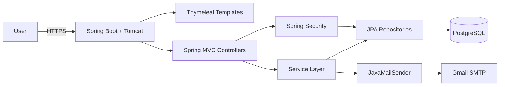
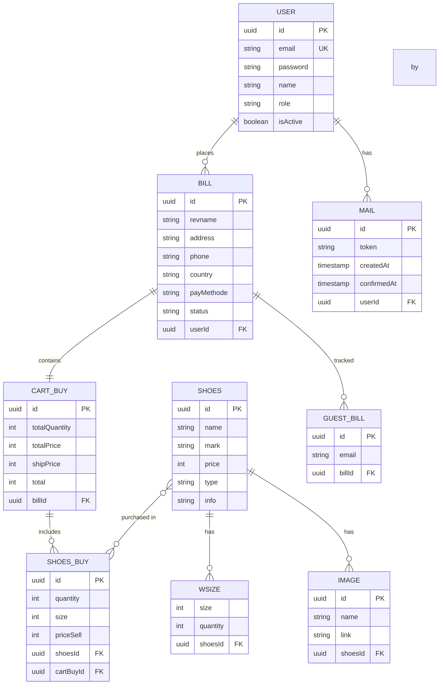

# G8 Shoe Store — E-Commerce Website (CNPM)

> A full-stack e-commerce web application for selling shoes, built with Spring Boot, PostgreSQL, and Thymeleaf.

---

## Overview

This project is a full-stack e-commerce web application for selling shoes, developed as a university software engineering project (CNPM — Công Nghệ Phần Mềm) at Ho Chi Minh City University of Technology and Education (HCMUTE).

The application allows users to browse shoes, manage a shopping cart, register accounts with email verification, place orders, and track guest orders — all with a bilingual (Vietnamese/English) UI.

---

## Features

- Product catalog with images, prices (VND), sizes, and descriptions
- Search by product name or filter by type (men/women)
- Product detail pages with size selection
- User registration with email verification (token-based activation)
- Login/logout with Spring Security form-based authentication
- Session-based shopping cart (add, edit quantity/size, remove items)
- Checkout and order placement (registered user or guest)
- Guest order tracking by email + bill code
- Password recovery via email token
- Bilingual UI (Vietnamese default, English) via Spring i18n
- Responsive design with Thymeleaf templates

---

## Tech Stack

### Backend
- **Framework:** Spring Boot 2.5.1
- **Language:** Java 16
- **ORM:** Spring Data JPA / Hibernate
- **Authentication:** Spring Security (form-based, BCrypt)
- **Templating:** Thymeleaf
- **Email:** JavaMailSender (Gmail SMTP)
- **Validation:** Spring Validation

### Frontend
- **Framework:** Thymeleaf (server-side rendering)
- **Styling:** Custom CSS, Bootstrap
- **JavaScript:** jQuery, custom JS

### Database
- **Database:** PostgreSQL

### Infrastructure
- **Build Tool:** Maven
- **Containerization:** Docker (Dockerfile included)
- **SSL:** HTTPS on port 8443 with PKCS12 keystore

---

## Architecture



The application follows a traditional Spring Boot MVC architecture with server-side rendering via Thymeleaf.

---

## Request Flow

### Authentication Flow

```text
User
  ↓
GET / (login page)
  ↓
POST /login
  ↓
Spring Security DaoAuthenticationProvider
  ↓
ApplicationUserService.loadUserByEmail()
  ↓
UserDAO → PostgreSQL
  ↓
BCryptPasswordEncoder.matches()
  ↓
SuccessHandler → HTTP 200
  ↓
Session created
```

### Checkout Flow

```text
User
  ↓
GET /checkout
  ↓
CheckoutController
  ↓
POST /pay
  ↓
BillService.createBill()
  ↓
CartService.getCart() → Session cart
  ↓
BillDAO.save() → PostgreSQL
  ↓
CartBuyDAO.save() → PostgreSQL
  ↓
ShoesBuyDAO.save() → PostgreSQL
  ↓
Cart cleared
  ↓
GET /thank
```

---

## Backend Architecture

The application follows a layered architecture:

```text
Controller (Spring MVC)
    ↓
Service (Business Logic)
    ↓
DAO (Spring Data JPA Repositories)
    ↓
Database (PostgreSQL)
```

### Controllers
- `HomeController` — Product listing and search
- `SignupController` — Registration, email verification, password reset
- `SessionController` — Session management
- `ItemController` — Product detail pages
- `CartContoller` — Cart management
- `CheckoutController` — Checkout and order placement
- `OrderController` — Guest order tracking
- `AccountController` — Password change

### Services
- `UserService` — User business logic
- `SchoesService` — Product business logic
- `BillService` — Order business logic
- `CartService` — Cart business logic
- `ShoesBuyService` — Purchase business logic
- `GuestBillService` — Guest order business logic
- `ImageService` — Image business logic

### Configuration
- `SecurityAdapter` — Spring Security configuration
- `PasswordConfig` — BCryptPasswordEncoder bean
- `MailConfig` — JavaMailSender configuration
- `SourceConfig` — i18n locale resolver

---

## Database Design



---

## API

### Home & Products

| Method | Endpoint | Description |
|--------|----------|-------------|
| GET | `/` | Home page — product listing; supports `?search=` for name search or `?search=men`/`?search=women` for type filter |
| GET | `/info/{id}` | Product detail page by UUID |

### Authentication & Account

| Method | Endpoint | Description |
|--------|----------|-------------|
| POST | `/signup` | Register new user; sends verification email |
| GET | `/signup/{email}/{code}` | Confirm signup token (5-min expiry) |
| POST | `/forget?email=` | Send password reset email |
| GET | `/forget/{code}/{token}` | Confirm password reset token |
| POST | `/verify?email=` | Resend verification email |
| GET | `/verify/{email}/{code}` | Confirm re-sent verification token |
| POST | `/destroy` | Logout (invalidate session) |
| POST | `/changepassword?passold=&passnew=&id=` | Change password (logged-in user) |
| POST | `/changepassf?password1=&password2=&id=` | Set new password after reset |

### Cart & Checkout

| Method | Endpoint | Description |
|--------|----------|-------------|
| GET | `/cart?id=&action=` | View cart; `action=delete` removes item |
| POST | `/cart?id=&quantity=&size=` | Add item to cart (or update if exists) |
| POST | `/cartinfo` | Returns cart as JSON |
| GET | `/checkout` | Checkout page |
| POST | `/pay` | Place order — saves bill, cart snapshot, and items |
| GET | `/thank` | Order confirmation page |

### Order Tracking

| Method | Endpoint | Description |
|--------|----------|-------------|
| GET | `/order` | Guest order lookup page |
| POST | `/forder?code=&email=` | Look up guest order by bill code + email |

---

## Authentication & Authorization

```text
User
  ↓
POST /login
  ↓
Spring Security DaoAuthenticationProvider
  ↓
ApplicationUserService.loadUserByEmail()
  ↓
UserDAO → PostgreSQL
  ↓
BCryptPasswordEncoder.matches()
  ↓
SuccessHandler → HTTP 200
  ↓
Session created (JDBC session storage)
```

- **Authentication:** Spring Security form-based authentication
- **Password Encoding:** BCryptPasswordEncoder (strength 10)
- **Session Storage:** JDBC-based (`spring.session.store-type=jdbc`), 24-hour timeout
- **Remember-me:** Enabled, 7-day token validity
- **Account Activation:** Users start as `isActive=false`; must click email verification link
- **Password Reset:** Token-based via email (5-minute expiry)
- **Roles:** Single role `ROLE_USER` (defined in `Permission` enum)
- **CSRF:** Disabled (for development purposes)
- **Authorization:** All requests permitted (`anyRequest().permitAll()`)

---

## Important Technical Decisions

### Why Spring Boot?

**Problem:** Building a full-stack e-commerce application requires rapid development, dependency injection, and enterprise-grade security.

**Decision:** Use Spring Boot 2.5.1 with Spring MVC, Spring Data JPA, and Spring Security.

**Reason:** Spring Boot provides a mature ecosystem for building Java web applications with minimal configuration, integrated security, and ORM support.

**Trade-off:** Spring Boot applications have higher memory footprint compared to lightweight frameworks.

### Why Thymeleaf Server-Side Rendering?

**Problem:** The project requires a bilingual UI with dynamic content rendering.

**Decision:** Use Thymeleaf for server-side template rendering.

**Reason:** Thymeleaf integrates seamlessly with Spring Boot, supports i18n out of the box, and allows rapid development of server-rendered pages without a separate frontend build step.

**Trade-off:** Server-side rendering requires full page reloads compared to SPA approaches.

### Why Session-Based Cart?

**Problem:** Shopping cart needs to persist across multiple requests without requiring user authentication.

**Decision:** Store cart in HTTP session as an in-memory `Cart` object.

**Reason:** Simplifies the checkout flow for guest users and avoids database writes for temporary cart data.

**Trade-off:** Cart data is lost when the session expires or the server restarts.

---

## Error Handling & Validation

- Spring Security handles authentication failures (400 for inactive user, 404 for not found)
- No custom global exception handler is implemented
- Form validation is handled by Spring MVC

---

## Testing

Testing is currently limited in the MVP and is an area for future improvement.

---

## Docker / Local Development

### Prerequisites
- JDK 16
- Apache Maven 3.6+
- PostgreSQL 12+

### Database Setup

```sql
CREATE DATABASE shop;
```

Default connection settings (in `application.properties`):
- URL: `jdbc:postgresql://localhost:5432/shop`
- Username: `postgres`
- Password: `password`

### Email Configuration

Update `shop/src/main/resources/config/config.properties` with your Gmail SMTP credentials.

### Build & Run

```bash
git clone https://github.com/longdrache/CNPM.git
cd CNPM/shop

mvn clean install
mvn spring-boot:run
```

Or run the JAR directly:

```bash
java -jar target/shop.jar
```

The app will be available at `https://localhost:8443`.

### Docker

```bash
docker build -t shop .
docker run -p 8443:8443 -e PORT=8443 shop
```

---

## Environment Variables

```properties
# Database
spring.datasource.url=jdbc:postgresql://localhost:5432/shop
spring.datasource.username=postgres
spring.datasource.password=password

# Email
spring.mail.host=smtp.gmail.com
spring.mail.port=587
spring.mail.username=your-email@gmail.com
spring.mail.password=your-app-password

# SSL
server.port=8443
server.ssl.key-store=classpath:localhost.p12
server.ssl.key-store-password=password
server.ssl.key-alias=localhost
```

---

## Project Structure

```
CNPM/
├── README.md
└── shop/
    ├── pom.xml                        # Maven build (Spring Boot 2.5.1, Java 16)
    ├── Dockerfile                     # Docker image (openjdk:16-jdk-alpine)
    └── src/main/
        ├── java/com/hcmute/shop/
        │   ├── ShopApplication.java          # Spring Boot entry point
        │   ├── Configuration/                # Security, mail, i18n config
        │   ├── Controller/                   # Spring MVC controllers
        │   ├── Service/                      # Business logic
        │   ├── DAO/                          # Spring Data JPA repositories
        │   └── Model/                        # JPA entities & DTOs
        └── resources/
            ├── application.properties       # App config (DB, SSL, JPA)
            ├── config/config.properties      # Gmail credentials
            ├── home_vi.properties           # Vietnamese i18n messages
            ├── home_en.properties           # English i18n messages
            ├── templates/                   # Thymeleaf HTML templates
            └── static/
                ├── image/                   # Product images
                ├── js/                      # JavaScript files
                └── style/                   # CSS files
```

---

## Deployment

The application can be Dockerized using the included `Dockerfile` (openjdk:16-jdk-alpine). No cloud deployment configuration is included in the repository.

---

## CI/CD

No CI/CD pipeline is configured in the repository.

---

## Challenges & Solutions

### Challenge: Guest Order Tracking

**Problem:** Guest users (without accounts) need a way to track their orders.

**Decision:** Implement a `GuestBill` entity that links an email address to a bill code.

**Reason:** Allows guest users to look up their orders by providing their email and bill code without requiring account creation.

**Trade-off:** Less secure than authenticated order tracking since anyone with the email and code can view the order.

### Challenge: Bilingual UI

**Problem:** The application needs to support both Vietnamese and English users.

**Decision:** Use Spring i18n with `LocaleResolver` and message properties files (`home_vi.properties`, `home_en.properties`).

**Reason:** Spring i18n provides a clean separation of locale-specific text and allows runtime language switching via `?lang=` parameter.

**Trade-off:** Requires maintaining separate message files for each supported language.

---

## What I Learned

- Building a full-stack e-commerce application with Spring Boot and Spring Security
- Implementing email-based verification and password reset flows
- Designing a relational database schema for e-commerce (products, orders, cart, users)
- Using Spring Data JPA for database access
- Implementing session-based shopping cart
- Configuring Spring Security with form-based authentication and BCrypt
- Internationalization (i18n) with Spring MVC and Thymeleaf

---

## Future Improvements

- Add role-based access control for admin endpoints
- Implement CSRF protection
- Add automated tests (unit and integration)
- Implement payment gateway integration (PayPal, Stripe)
- Add product review and rating system
- Improve error handling with custom exception handlers
- Add caching for frequently accessed product data

---

## Demo

No live demo is deployed. The application runs locally via Maven or Docker.

---

## Resume Summary

- Built a full-stack e-commerce web application using Java 16, Spring Boot 2.5.1, and PostgreSQL
- Implemented user authentication and authorization with Spring Security, BCrypt password encoding, and email verification
- Designed and implemented a relational database schema with 9 entities (users, products, orders, cart, etc.) using Spring Data JPA
- Developed a session-based shopping cart and checkout flow with guest order tracking
- Implemented bilingual (Vietnamese/English) UI using Spring i18n and Thymeleaf
- Containerized the application using Docker with HTTPS configuration
